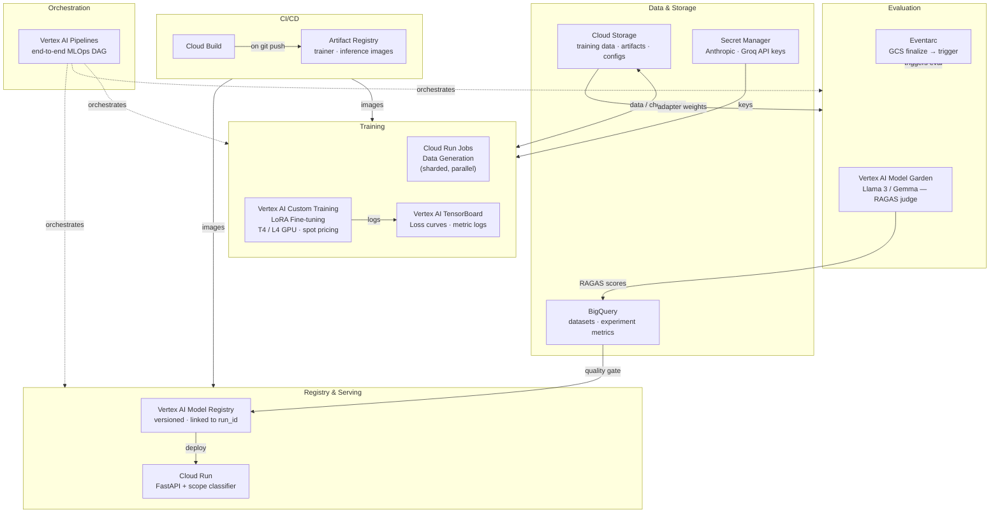

# SLM Pipeline — GCP Migration Plan

Migrates a single-machine LoRA fine-tuning workflow to a managed, scalable GCP stack. Six phased milestones from storage baseline to full MLOps automation.

---

## Pain Points → Solutions

| Pain Point | GCP Fix |
|---|---|
| Training blocked by laptop hardware | Vertex AI Custom Training (T4/L4 GPU, spot pricing) |
| Data and artifacts lost on machine wipe | Cloud Storage (versioned, lifecycle-managed) |
| No experiment history across runs | Vertex AI TensorBoard + BigQuery metrics table |
| RAGAS evaluation requires local Ollama | Vertex AI Model Garden (managed LLM endpoint) |
| Inference requires developer's machine | Cloud Run (serverless, always-on) |
| API keys in plaintext `.env` | Secret Manager (IAM-scoped, audit-logged) |
| Manual `make train` workflow | Vertex AI Pipelines (automated DAG) |

---

## GCP Service Map

| Pipeline Layer | Current | GCP Service |
|---|---|---|
| Secret / API key storage | `.env` file | Secret Manager |
| Training data + configs | `data/`, `configs/` | Cloud Storage |
| Model artifact storage | `artifacts/` | Cloud Storage |
| Synthetic data generation | Local async script | Cloud Run Jobs |
| Training compute | Laptop CPU/MPS | Vertex AI Custom Training |
| Container image registry | Local Docker | Artifact Registry |
| Experiment tracking | Local TensorBoard | Vertex AI TensorBoard |
| RAGAS LLM judge | Ollama localhost | Vertex AI Model Garden |
| Metric history & quality gates | `ragas_results.json` | BigQuery |
| Pipeline orchestration | Manual Makefile | Vertex AI Pipelines |
| Model versioning | Local `artifacts/exports/` | Vertex AI Model Registry |
| Model serving | `python src/run_model.py` | Cloud Run |
| CI/CD | None | Cloud Build |
| Event-driven triggers | None | Eventarc |

---

## System Architecture

---

## Pipeline Flow (Automated)

---

## Phased Roadmap

| Phase | Focus | Key Services | Effort | Priority |
|---|---|---|---|---|
| 1 | Storage + secrets baseline | GCS, Secret Manager | 2–4 h | **Start here** |
| 2 | GPU training | Vertex AI Custom Training, Artifact Registry, TensorBoard | 1–2 d | High |
| 3 | Scalable data generation | Cloud Run Jobs, BigQuery | 1–2 d | High |
| 4 | Automated evaluation | Vertex AI Model Garden, BigQuery, Eventarc | 1 d | Medium |
| 5 | Model serving endpoint | Cloud Run, Vertex AI Model Registry | 2–3 d | Medium |
| 6 | Full MLOps pipeline | Vertex AI Pipelines, Cloud Build | 3–5 d | Low (future) |

### Phase 1 — Storage & Secrets

- **Secret Manager:** replace `os.getenv("ANTHROPIC_API_KEY")` in `llm_client.py`; remove `.env` from repo
- **Cloud Storage:** three buckets — `slm-training-data`, `slm-artifacts`, `slm-logs`
- **Files:** `llm_client.py`, both training YAMLs (`output_dir → gs://`), `generate_dataset.py`, `evaluate_ragas.py`, `requirements.txt` (+`gcsfs`, `google-cloud-secret-manager`)

### Phase 2 — GPU Training

- **Artifact Registry:** push training container (`pytorch/pytorch` base + HF stack)
- **Vertex AI Custom Training:** submit job referencing container; config URI passed as env var
- **Vertex AI TensorBoard:** redirect `logging_dir` to `gs://slm-logs/`; runs linked to training job automatically
- **GPU options:**

  | GPU | On-demand/hr | Spot/hr | Est. run cost |
  |---|---|---|---|
  | T4 (8 vCPU, 30 GB) | $0.35 | $0.11 | ~$0.05–$0.10 |
  | L4 (8 vCPU, 30 GB) | $0.70 | $0.22 | ~$0.10–$0.20 |
  | A100 40GB | $2.93 | $0.88 | ~$0.40–$0.80 |

  Spot is safe: `save_steps=100` checkpoints land in GCS; interrupted jobs resume from latest checkpoint.

- **Files:** `Dockerfile` (new), `src/train_slm.py` (GCS config loading via `TRAINING_CONFIG_URI`), `requirements.txt` (+`google-cloud-aiplatform`)

### Phase 3 — Scalable Data Generation

- **Cloud Run Jobs:** containerise the three-phase data gen pipeline (product sampling → QA generation → quality filtering)
- Run 10 shards in parallel; each shard reads/writes `gs://slm-training-data/{raw,filtered}/shard-N.jsonl`
- **BigQuery:** merge shards into `slm_datasets.training_examples` for versioned, deduplicated, queryable datasets
- **Files:** `generate_dataset.py` (add `--shard-index`/`--total-shards`; GCS output), `Dockerfile.datagen` (new)

### Phase 4 — Evaluation Pipeline

- **Vertex AI Model Garden:** deploy Llama 3 8B or Gemma 3 9B; exposes OpenAI-compatible API — swap Ollama base URL in `evaluate_ragas.py`
- **BigQuery:** write RAGAS scores + perplexity delta into `slm_datasets.experiment_metrics` per run
- **Eventarc:** GCS `finalize` event on adapter weights → triggers Cloud Run → runs evaluation automatically
- **Files:** `evaluate_ragas.py` (Vertex endpoint, BQ write), `compare_eval_loss.py` (BQ write), `requirements.txt` (+`google-cloud-bigquery`)

### Phase 5 — Model Serving

- **Vertex AI Model Registry:** register merged model after export; each version linked to `run_id` and BigQuery metrics row
- **Cloud Run:** FastAPI wrapper around `run_model.py` + scope classifier in same container; scales to zero at idle

  | Option | Best for | Cold start | Cost @ 0 traffic |
  |---|---|---|---|
  | Cloud Run CPU | Demo / low traffic | 8–15 s | $0 |
  | Cloud Run GPU | Moderate traffic | 20–30 s | $0 |
  | Vertex AI Online Prediction | Production A/B | 30–60 s | $0 |
  | GKE + vLLM | High throughput | None | $200+/mo |

  **Recommendation:** Cloud Run CPU. TinyLlama-1.1B fits in 16 GB RAM; ~2–5 s inference on 8 vCPUs.

- **Files:** `inference/server.py` + `inference/Dockerfile` (new), `src/run_model.py` (accept `MODEL_URI` env var)

### Phase 6 — Full MLOps Orchestration

- **Vertex AI Pipelines (Kubeflow DSL):** wraps Phases 1–5 into a DAG with conditional branching (quality gate), retries, and input/output lineage
- **Cloud Build:** `cloudbuild.yaml` trigger on `git push main` rebuilds and pushes both container images with commit SHA tags

---

## Key Architectural Decisions

| Decision | Rationale |
|---|---|
| GCS over local filesystem | HuggingFace Trainer + `gcsfs` support `gs://` natively — zero architectural change |
| Cloud Run Jobs over GKE | Batch workload; no persistent cluster needed; managed retries included |
| Vertex AI Custom Training over SageMaker/AzureML | Accepts any container image; no framework-specific wrapper required |
| Cloud Run over Vertex AI Online Prediction for serving | TinyLlama-1.1B fits on CPU; scales to zero; simpler ops |
| BigQuery over JSON files for metrics | Enables cross-run regression detection and quality-gate queries |
| Eventarc for eval trigger | Replaces manual `make eval-ragas`; evaluation runs automatically on every checkpoint |
