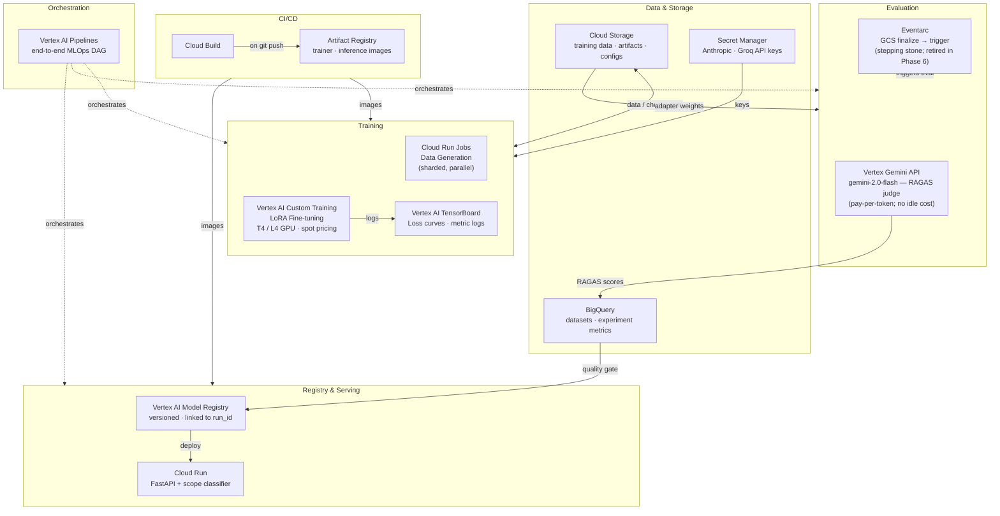
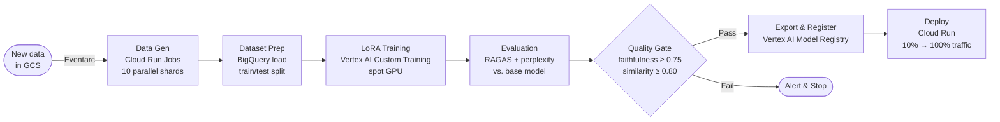

# SLM Pipeline — GCP Migration and Improvement Plan

This document describes the migration of a single-machine LoRA fine-tuning workflow to a managed, scalable GCP stack. The migration is structured as six sequential phases, each independently deployable, progressing from storage and secret management through full MLOps pipeline orchestration.

---

## Motivation

The baseline pipeline runs entirely on a local machine, which introduces several operational limitations:

- Training blocks the developer machine for hours and cannot leverage GPU hardware without dedicated hardware ownership.
- Data, model artifacts, and experiment configurations are tied to a single disk, with no portability across machines or team members.
- Hyperparameter-to-result mappings are not tracked across runs in a queryable store.
- RAGAS evaluation depends on a locally running Ollama instance with a specific model pulled.
- Inference is only available when the developer machine is active and the local Python environment is configured.

Each limitation is addressed by a purpose-built GCP managed service, detailed in the sections below.

---

## Pain Points and GCP Mitigations

| Pain Point | GCP Service |
|---|---|
| Training blocked by local hardware constraints | Vertex AI Custom Training (T4/L4 GPU, spot pricing) |
| Data and artifacts lost on machine wipe | Cloud Storage (versioned, lifecycle-managed) |
| No queryable experiment history across runs | Vertex AI TensorBoard + BigQuery metrics table |
| RAGAS evaluation requires local Ollama instance | Vertex AI Gemini API (pay-per-token judge; no endpoint management) |
| Inference requires developer's machine | Cloud Run (serverless, autoscaled) |
| API keys stored in plaintext `.env` | Secret Manager (IAM-scoped, audit-logged) |
| Manual `make train` workflow | Vertex AI Pipelines (automated DAG) |

---

## GCP Service Reference

### Secret Manager

**Description:** A managed vault for sensitive string values (API keys, passwords, tokens). Secrets are stored once and fetched by name at runtime via IAM-authenticated API calls. Every access is audit-logged.

**Relevance:** The data-generation pipeline authenticates against the Anthropic and Groq APIs. Storing these credentials in `.env` files creates accidental-exposure risk on `git add`. Secret Manager eliminates that risk and provides per-access audit trails.

**Cloud Run integration note:** Cloud Run's native Secret Manager binding can mount secrets as environment variables or files at container startup. This is IAM-controlled and audit-logged; credentials are never baked into the container image or source code.

---

### Cloud Storage (GCS)

**Description:** Managed object storage with a `gs://bucket-name/path` URI scheme. Analogous to Amazon S3. Supports versioning, lifecycle policies, and fine-grained IAM access control.

**Relevance:** The HuggingFace `Trainer` class resolves `gs://` output paths natively via `gcsfs`, meaning training checkpoints can be written to GCS without code changes. Any GCP service — training VMs, Cloud Run containers, local workstations — can read and write from the same bucket using consistent paths.

---

### Artifact Registry

**Description:** A private, managed Docker image registry hosted within GCP. Supports multiple artifact formats (container images, language packages). Integrates with IAM for access control and with Cloud Build for automated image publishing.

**Relevance:** Vertex AI Custom Training requires a container image. Artifact Registry stores versioned training and inference images, tagged with commit SHAs, ensuring full reproducibility of any training job.

---

### Vertex AI Custom Training

**Description:** A managed service that executes a Docker container on GCP-hosted hardware (NVIDIA T4, L4, A100). The caller specifies the container image, machine type, and environment variables; GCP provisions the VM, runs the job, and terminates the instance on completion. Billing is per-second of VM runtime.

**Relevance:** Replaces `python src/train_slm.py` running on a local CPU/MPS device. Provides GPU hardware without hardware ownership and decouples training from the developer workstation.

**Spot VM behavior:** Spot instances may be preempted by GCP to reclaim capacity. With checkpoint saving configured (`save_steps: 100`) to a GCS output directory, an interrupted job resumes from the latest checkpoint automatically on the next submission.

**GPU pricing reference:**

| GPU | On-demand / hr | Spot / hr | Estimated job cost |
|---|---|---|---|
| T4 (8 vCPU, 30 GB) | $0.35 | $0.11 | ~$0.05–$0.10 |
| L4 (8 vCPU, 30 GB) | $0.70 | $0.22 | ~$0.10–$0.20 |
| A100 40 GB | $2.93 | $0.88 | ~$0.40–$0.80 |

---

### Vertex AI TensorBoard

**Description:** A managed, persistent TensorBoard instance. Training jobs write metric logs to a GCS log directory; Vertex AI TensorBoard renders loss curves and scalar metrics in a web UI that persists across runs and is accessible to all project members.

**Relevance:** The local TensorBoard workflow (`tensorboard --logdir artifacts/experiments/`) requires the developer machine to be active and is ephemeral. The managed instance retains all historical run data and serves it without any local process running.

---

### Cloud Run Jobs

**Description:** A serverless compute platform for containerized batch workloads. Each job execution runs a container to completion and stops; there is no persistent server. Cloud Run Jobs supports parallel task execution via configurable task replicas.

**Relevance:** Data generation (`generate_dataset.py`) is a stateless batch process. Running it as a Cloud Run Job with 10 parallel task replicas — each writing to a distinct GCS shard path — reduces dataset generation time proportionally without requiring persistent cluster infrastructure.

---

### BigQuery

**Description:** A serverless, columnar data warehouse optimized for large-scale analytical queries over structured data. Supports standard SQL, automatic deduplication, and streaming inserts. No servers or indexes to manage.

**Relevance:** RAGAS scores currently write to `artifacts/ragas_results.json`. This format does not support cross-run queries (e.g., "did faithfulness improve when LoRA rank increased from 8 to 16?"). Appending each evaluation result as a row in BigQuery enables SQL-based regression detection and quality-gate threshold checks across all historical runs.

---

### Eventarc

**Description:** GCP's event routing service. Routes events emitted by GCP services (e.g., `google.cloud.storage.object.v1.finalized`) to configured targets such as Cloud Run services or Vertex AI Pipelines runs.

**Relevance:** Without an event-driven trigger, `make eval-ragas` must be invoked manually after each training job. An Eventarc trigger on the adapter weights GCS prefix fires evaluation automatically when the training job writes its output, removing the manual step.

---

### Vertex AI Model Garden

**Description:** A catalog of pre-trained, open-weight models (Llama 3, Gemma, Mistral, and others) served via managed API endpoints with an OpenAI-compatible REST interface.

**Cost consideration:** A dedicated Model Garden endpoint for an 8B-class model does not scale to zero. Idle cost is approximately **$1–3/hr**, which can exceed total training job cost for workloads with infrequent evaluation runs.

**Recommended alternative for periodic evaluation — Vertex Gemini API:** Calling `gemini-1.5-flash` or `gemini-2.0-flash` via the Vertex AI generative language API is billed per token with no endpoint to provision or maintain. RAGAS supports it natively via `LangchainLLMWrapper`. For per-run evaluation judges, this is almost always lower cost and operationally simpler than a dedicated open-weight endpoint.

**When Model Garden endpoints are appropriate:** When a specific open-weight model is required for compliance, data-residency, or output reproducibility reasons, and the workload frequency justifies the idle cost.

---

### Vertex AI Model Registry

**Description:** A versioned catalog of trained model artifacts. Each registered version stores a reference to the GCS artifact path, the training job that produced it, and associated metadata (hyperparameters, evaluation scores, dataset version).

**Relevance:** Without a registry, identifying which weights are deployed requires inspecting directory names. The registry provides full lineage traceability: training job → evaluation scores → deployed version, with rollback to any prior version.

---

### Cloud Run (Inference Serving)

**Description:** A serverless platform for long-lived HTTP services in containers. Unlike Cloud Run Jobs, a Cloud Run *service* handles incoming HTTP requests, scales to zero when idle (zero-cost at idle), and scales horizontally under load. GCP manages TLS termination and traffic routing.

**Relevance:** The current inference workflow requires `python src/run_model.py` running on the developer's machine. Packaging the model and scope classifier into a Cloud Run service exposes an HTTPS endpoint callable by any client, with automatic scaling and zero-downtime deployments.

---

### Vertex AI Pipelines

**Description:** A managed pipeline orchestration platform based on the Kubeflow Pipelines (KFP) SDK. ML workflows are defined as Python DAGs using the `@component` decorator; each node runs as an isolated containerized step. The platform manages scheduling, retries, parallelism, artifact lineage, and run history.

**Relevance:** The current workflow consists of three manual commands: `make train → make eval-ragas → make export-merged`. Vertex AI Pipelines automates this sequence, adds conditional branching on evaluation quality gates, and records per-run inputs, outputs, and execution timing in a persistent UI.

---

### Cloud Build

**Description:** A managed continuous integration service. Build pipelines are defined in `cloudbuild.yaml`; Cloud Build triggers them on `git push`, executes build steps (lint, test, `docker build`, `docker push`), and reports pass/fail status.

**Relevance:** Without CI, the training container image reflects whatever was last built locally. Cloud Build ensures every merge to `main` produces a versioned container image tagged with the commit SHA, providing reproducibility guarantees for all training jobs.

---

## GCP Service Map

| Pipeline Layer | Current Implementation | GCP Service | Rationale |
|---|---|---|---|
| Secret / API key storage | `.env` file | Secret Manager | Audit-logged, IAM-scoped; eliminates plaintext secrets in the repository |
| Training data + configs | `data/`, `configs/` | Cloud Storage | Native `gs://` support in HF Trainer; versioned; accessible from any GCP compute resource |
| Model artifact storage | `artifacts/` | Cloud Storage | Checkpoints survive VM preemption; consistent path scheme across services |
| Synthetic data generation | Local async script | Cloud Run Jobs | 10-way parallel sharding; per-second billing; no idle cost |
| Training compute | Local CPU / MPS | Vertex AI Custom Training | Any GPU type; spot pricing; no VM lifecycle management |
| Container image registry | Local Docker daemon | Artifact Registry | Private; low-latency pulls within GCP network; IAM-integrated |
| Experiment tracking | Local TensorBoard | Vertex AI TensorBoard | Persistent across runs; team-accessible; no local process required |
| RAGAS LLM judge | Ollama localhost | Vertex AI Gemini API | Pay-per-token; no endpoint management; scales to zero; native RAGAS support |
| Metric history and quality gates | `ragas_results.json` | BigQuery | SQL-queryable cross-run history; quality-gate thresholds as SQL predicates |
| Pipeline orchestration | Manual Makefile | Vertex AI Pipelines | Automated DAG with conditional branching, retries, and artifact lineage |
| Model versioning | Local `artifacts/exports/` | Vertex AI Model Registry | Full training-to-deployment lineage; per-version rollback |
| Model serving | `python src/run_model.py` | Cloud Run | Serverless; scales to zero; managed HTTPS; zero-downtime deployments |
| CI/CD | None | Cloud Build | Rebuilds container images on every `git push main` with commit SHA tagging |
| Event-driven triggers | None | Eventarc | GCS object finalize → automatic evaluation run; removes manual trigger dependency |

---

## System Architecture

---

## Automated Pipeline Flow

---

## Phased Roadmap

Phases are sequenced so each phase establishes the prerequisites for the next. Any phase represents a stable, independently useful checkpoint.

| Phase | Focus | Key Services | Estimated Effort | Priority |
|---|---|---|---|---|
| 1 | Storage and secrets baseline | GCS, Secret Manager | 2–4 h | Critical |
| 2 | GPU training | Vertex AI Custom Training, Artifact Registry, TensorBoard | 1–2 d | High |
| 3 | Scalable data generation | Cloud Run Jobs, BigQuery | 1–2 d | High |
| 4 | Automated evaluation | Vertex Gemini API, BigQuery, Eventarc | 1 d | Medium |
| 5 | Model serving endpoint | Cloud Run, Vertex AI Model Registry | 2–3 d | Medium |
| 6 | Full MLOps pipeline | Vertex AI Pipelines, Cloud Build | 3–5 d | Low (future) |

---

### Phase 1 — Storage and Secrets

**Objective:** Replace local filesystem paths and plaintext API keys with managed cloud equivalents. This phase introduces no new compute resources; the scope is limited to data portability and credential security.

**Implementation:**

- **Secret Manager:** Replace all `os.getenv("ANTHROPIC_API_KEY")` calls in `llm_client.py` with Secret Manager fetch calls. Remove `.env` from the repository. Team members with the appropriate IAM role can run data generation without manual credential sharing.
- **Cloud Storage:** Provision three buckets — `slm-training-data`, `slm-artifacts`, `slm-logs` — and update `output_dir` in both training configuration YAMLs to `gs://` paths. The HuggingFace `Trainer` writes checkpoints directly to GCS from this point forward.

**Files affected:** `llm_client.py`, `configs/default_training.yaml`, `configs/mps_training.yaml`, `src/generate_dataset.py`, `src/evaluate_ragas.py`, `requirements.txt` (add `gcsfs`, `google-cloud-secret-manager`).

---

### Phase 2 — GPU Training

**Objective:** Migrate `make train` from the local machine to a cloud GPU instance. After this phase, training is submitted as a job rather than executed on the developer's workstation.

**Implementation:**

- **Artifact Registry:** Build a Docker image from a `pytorch/pytorch` base with the full HuggingFace training stack. Push to Artifact Registry tagged with the current git SHA.
- **Vertex AI Custom Training:** Define a job specification referencing the container image and a `TRAINING_CONFIG_URI` environment variable pointing at the training YAML in GCS. On submission, GCP provisions the specified GPU instance, executes the container, and terminates on completion.
- **Vertex AI TensorBoard:** Set `logging_dir` in the training configuration to `gs://slm-logs/`. Vertex AI automatically associates each training job's logs with the TensorBoard instance; no additional instrumentation is required.

**Spot VM checkpoint recovery:** With `save_steps: 100` writing checkpoints to GCS, a preempted spot VM loses at most 100 training steps. The subsequent job submission resumes from the latest available checkpoint automatically.

**Files affected:** `Dockerfile` (new), `src/train_slm.py` (add `TRAINING_CONFIG_URI` environment variable resolution), `requirements.txt` (add `google-cloud-aiplatform`).

---

### Phase 3 — Scalable Data Generation

**Objective:** Replace the single-process `generate_dataset.py` script with a parallelized, containerized job capable of generating datasets at 10x throughput.

**Implementation:**

- **Cloud Run Jobs:** Containerize the three-phase data pipeline (product sampling → QA generation → quality filtering). Configure the job with 10 task replicas. Each task reads a shard index from an environment variable (`SHARD_INDEX`, `TOTAL_SHARDS`) and writes output to `gs://slm-training-data/filtered/shard-N.jsonl`.
- **BigQuery:** After all shards complete, load and merge shard files into `slm_datasets.training_examples`. BigQuery deduplicates rows on insert and maintains a queryable history of all examples across dataset versions.

**Files affected:** `src/data_gen/generate_dataset.py` (add `--shard-index` / `--total-shards` arguments; write output to GCS paths), `Dockerfile.datagen` (new).

---

### Phase 4 — Automated Evaluation

**Objective:** Trigger evaluation automatically on adapter weight publication to GCS, using a managed LLM judge in place of the local Ollama dependency.

**Implementation:**

- **Vertex AI Gemini API (judge):** Replace the Ollama `base_url` configuration in `evaluate_ragas.py` with a `gemini-2.0-flash` call via RAGAS's `LangchainLLMWrapper`. No endpoint to provision or maintain; billing is per token at evaluation time only.

  > **Model Garden vs. Gemini API:** For infrequent evaluation runs, the Gemini API (pay-per-token, no idle cost) is strongly preferred over a dedicated Model Garden endpoint, which incurs approximately $1–3/hr of idle cost even when no evaluation is running. A dedicated open-weight endpoint is appropriate only when a specific model is required for compliance or data-residency reasons.

- **BigQuery:** Append RAGAS scores and perplexity delta to `slm_datasets.experiment_metrics` at the end of each evaluation run, keyed by `run_id`. This provides the data required for the quality gate in Phase 6.
- **Eventarc:** Create a trigger on the `gs://slm-artifacts/adapters/` prefix for the `google.cloud.storage.object.v1.finalized` event. The trigger invokes a Cloud Run container that executes the evaluation pipeline, removing the `make eval-ragas` manual step.

  > **Phase 6 deprecation note:** This Eventarc trigger is a transitional mechanism. Once Vertex AI Pipelines orchestrates the full DAG in Phase 6, evaluation is an explicit downstream step of training — the external trigger becomes redundant and should be disabled to prevent duplicate evaluation runs.

**Files affected:** `src/evaluate_ragas.py` (Vertex endpoint URL, BigQuery write), `src/compare_eval_loss.py` (BigQuery write), `requirements.txt` (add `google-cloud-bigquery`).

---

### Phase 5 — Model Serving

**Objective:** Expose the exported model as an authenticated HTTPS API endpoint with the scope classifier integrated as a request gate.

**Implementation:**

- **Vertex AI Model Registry:** After export, register the merged model with a version entry linking to the GCS artifact path, the training `run_id`, and the corresponding BigQuery metrics row. This establishes a traceable lineage from raw data through training, evaluation, and deployment.
- **Cloud Run:** Implement a FastAPI wrapper around `run_model.py` that accepts a POST request containing a prompt, applies the scope classifier, invokes the SLM, and returns the response. Package with `inference/Dockerfile`. Cloud Run manages TLS, traffic routing, and horizontal scaling.

**Serving configuration trade-offs:**

| Configuration | Optimal Use Case | Cold Start (container + weights) | Cost at Zero Traffic |
|---|---|---|---|
| Cloud Run CPU (`min-instances=0`) | Demo / bursty traffic | 30–90 s total¹ | $0 |
| Cloud Run CPU (`min-instances=1`) | Low-latency demos | ~0 s | ~$15–25/mo |
| Cloud Run GPU | Moderate traffic | 60–120 s total | $0 |
| Vertex AI Online Prediction | Production A/B testing | 30–60 s | $0 |
| GKE + vLLM | High-throughput production | None | $200+/mo |

¹ Container startup alone is 8–15 s. Loading TinyLlama-1.1B weights from GCS into CPU RAM adds 20–60 s depending on memory bandwidth, yielding 30–90 s total cold-start latency.

**Configuration guidance:**
- **Cost-sensitive / demo:** `min-instances=0`. First request after idle incurs full cold-start latency.
- **Latency-sensitive:** `min-instances=1`. Eliminates cold starts at a fixed cost of ~$15–25/mo, removing the zero-idle-cost property.

Weight loading from GCS at startup is the dominant cold-start latency source. `min-instances=1` is the correct lever for eliminating cold starts; changing machine type does not materially improve this.

**Files affected:** `inference/server.py` + `inference/Dockerfile` (new), `src/run_model.py` (add `MODEL_URI` environment variable for GCS artifact path resolution).

---

### Phase 6 — Full MLOps Orchestration

**Objective:** Replace the sequential manual phase execution with a single automated pipeline covering the complete ML lifecycle, including quality-gated conditional branching.

**Implementation:**

- **Vertex AI Pipelines (Kubeflow DSL):** Define the complete workflow as a Python module in which each function decorated with `@component` compiles to an isolated containerized pipeline step. The quality gate is implemented as a conditional edge: if `faithfulness < 0.75`, the pipeline terminates and emits an alert; if the gate passes, the pipeline proceeds to export and deployment.
- **Cloud Build:** Define a `cloudbuild.yaml` that triggers on `git push main`. Steps rebuild the trainer and inference container images, tag them with the commit SHA, push to Artifact Registry, and optionally submit a new pipeline run.

---

## Architectural Decision Record

| Decision | Rationale |
|---|---|
| GCS over local filesystem | HuggingFace Trainer resolves `gs://` paths natively via `gcsfs`; no code changes required to redirect output |
| Cloud Run Jobs over GKE | Data generation is a stateless batch workload; a persistent cluster adds unnecessary operational overhead |
| Vertex AI Custom Training over SageMaker / AzureML | Accepts arbitrary Docker images without framework-specific wrappers or SDKs |
| Cloud Run over Vertex AI Online Prediction for serving | TinyLlama-1.1B fits on CPU; Cloud Run scales to zero; operationally simpler for low-traffic deployments |
| BigQuery over JSON files for metrics | Enables cross-run regression detection and quality-gate predicate evaluation via standard SQL |
| Eventarc for evaluation trigger (Phases 1–5) | Decouples training job completion from evaluation invocation; superseded by Vertex AI Pipelines in Phase 6 |
