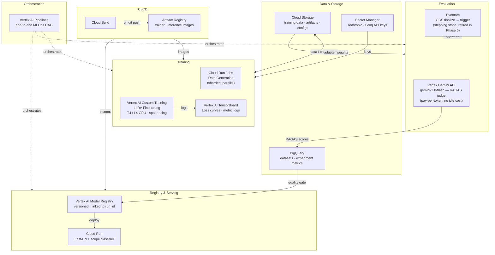

# SLM Pipeline — GCP Migration Plan

Migrates a single-machine LoRA fine-tuning workflow to a managed, scalable GCP stack. Six phased milestones from storage baseline to full MLOps automation.

---

## Why move to GCP at all?

Right now the pipeline runs entirely on your laptop. That's fine for learning, but it creates real problems as you go further:

- Training blocks your machine for hours (or fails because you don't have a GPU).
- A disk wipe, a new machine, or a teammate joining means starting over from scratch.
- There's no record of what hyperparameters produced what results.
- Evaluation requires Ollama running locally with a specific model pulled.
- Inference only works when your laptop is open and your Python env is active.

GCP solves each of these problems with purpose-built managed services. The table below maps every pain point to its fix, and the rest of the document explains *what each service is* and *why it's the right tool*.

---

## Pain Points → Solutions

| Pain Point | GCP Fix |
|---|---|
| Training blocked by laptop hardware | Vertex AI Custom Training (T4/L4 GPU, spot pricing) |
| Data and artifacts lost on machine wipe | Cloud Storage (versioned, lifecycle-managed) |
| No experiment history across runs | Vertex AI TensorBoard + BigQuery metrics table |
| RAGAS evaluation requires local Ollama | Vertex AI Gemini API (pay-per-token judge; no endpoint to manage) |
| Inference requires developer's machine | Cloud Run (serverless, always-on) |
| API keys in plaintext `.env` | Secret Manager (IAM-scoped, audit-logged) |
| Manual `make train` workflow | Vertex AI Pipelines (automated DAG) |

---

## GCP Service Glossary

Before diving into the phases, here's what each service actually is. Read this section once — it will make every later decision obvious.

### Secret Manager
**What it is:** A vault for sensitive strings (API keys, passwords, tokens). You store a secret once; your code fetches it by name at runtime with proper authentication. Nothing sensitive ever touches a config file or plaintext `.env` file.

**Why it matters here:** The data-generation pipeline calls Anthropic and Groq APIs. Right now those keys live in `.env`, which is one accidental `git add` away from being public. Secret Manager removes that risk entirely and logs every time a key is accessed.

**A note on Cloud Run integration:** Cloud Run's native Secret Manager binding mounts secrets as environment variables or files inside the container at startup — that's still audit-logged and IAM-controlled, and far safer than `.env` files. Keys don't live in your source code or image; they just arrive as env vars at runtime rather than being fetched by your application code directly.

**Mental model:** Think of it as a locked safe with a receptionist. Your code says "give me `ANTHROPIC_API_KEY`" — the receptionist checks your identity (IAM role), then hands over the value. You never see where the safe is.

---

### Cloud Storage (GCS)
**What it is:** Object storage — the GCP equivalent of Amazon S3. You upload files (data, checkpoints, configs, model weights) to named *buckets*, and any GCP service can read or write them using a `gs://bucket-name/path` URI.

**Why it matters here:** HuggingFace Trainer already understands `gs://` paths natively via `gcsfs`. That means you can point `output_dir` at a GCS bucket and your training checkpoints are automatically cloud-stored with zero architectural change.

**Mental model:** Like a shared hard drive in the cloud. Any machine — your laptop, a training VM, a Cloud Run container — can read and write the same files. No more "it's on my machine" problems.

---

### Artifact Registry
**What it is:** A private Docker image registry hosted on GCP. You push container images (the "packaged environment" for your training or inference code) here, and other GCP services pull from it.

**Why it matters here:** Vertex AI Custom Training runs your code inside a Docker container. Artifact Registry is where that container lives. It's version-controlled (each `git push` can rebuild and push a new image tagged with the commit SHA), which means you can always reproduce exactly what ran in a given training job.

**Mental model:** Like Docker Hub, but private, faster within GCP's network, and integrated with IAM permissions.

---

### Vertex AI Custom Training
**What it is:** A managed service that runs a Docker container on GCP-hosted hardware — including NVIDIA T4, L4, and A100 GPUs. You specify the container image, machine type, and any environment variables; GCP spins up the VM, runs your job, and shuts it down when it finishes. You only pay for the time the VM is running.

**Why it matters here:** This replaces `python src/train_slm.py` running on your laptop. You get GPU hardware without owning hardware, and training no longer blocks your machine.

**Spot pricing:** GCP can preempt spot VMs to reclaim capacity, but because checkpoints land in GCS every N steps, an interrupted job can resume from the latest checkpoint automatically.

**GPU options:**

| GPU | On-demand/hr | Spot/hr | Est. run cost |
|---|---|---|---|
| T4 (8 vCPU, 30 GB) | $0.35 | $0.11 | ~$0.05–$0.10 |
| L4 (8 vCPU, 30 GB) | $0.70 | $0.22 | ~$0.10–$0.20 |
| A100 40GB | $2.93 | $0.88 | ~$0.40–$0.80 |

---

### Vertex AI TensorBoard
**What it is:** A managed, persistent version of the TensorBoard you already use locally. Training jobs write loss curves and metrics to a GCS log directory; Vertex AI TensorBoard renders them in a web UI that persists across runs and is accessible to anyone on the team.

**Why it matters here:** Right now TensorBoard only works while `tensorboard --logdir artifacts/experiments/` is running on your machine. The managed version means metrics from every training run — including ones you kicked off from a GCP VM — are always available in one place.

**Mental model:** Your local TensorBoard is like a sticky note. Vertex AI TensorBoard is like a shared notebook that never gets thrown away.

---

### Cloud Run Jobs
**What it is:** A serverless compute platform for running containerised *batch* workloads. A "job" is a container that runs to completion, then stops. You pay only for the CPU/memory used during execution. Cloud Run Jobs supports running multiple identical containers in parallel (called "tasks").

**Why it matters here:** Data generation (`generate_dataset.py`) is a batch process — it runs once, produces output files, and exits. There's no need to keep a server running. Cloud Run Jobs lets you run 10 shards of data generation in parallel, each writing to a different GCS path, drastically reducing the time to generate a large dataset.

**Mental model:** Like `make -j10` on a serverless cloud. Each "shard" is an independent worker that picks up a slice of the work.

---

### BigQuery
**What it is:** A serverless, columnar data warehouse designed for large-scale analytical queries. You can query terabytes of data in seconds using standard SQL. Unlike a traditional database, there are no servers to manage and no indexes to maintain.

**Why it matters here:** Right now RAGAS scores are written to `artifacts/ragas_results.json`. That's fine for a single run, but you can't answer "did faithfulness improve after I increased LoRA rank from 8 to 16?" without opening multiple JSON files and comparing manually. BigQuery turns every evaluation run into a row you can query across runs, experiments, and model versions.

**Mental model:** Think of it as a giant spreadsheet in the cloud that you query with SQL. Every training run appends a row; you can slice and filter across all runs at once.

---

### Eventarc
**What it is:** GCP's event routing service. It listens for events from GCP services (like "a file was written to GCS") and triggers a target (like a Cloud Run container or a Vertex AI Pipeline). It's the glue that makes the pipeline event-driven instead of requiring manual triggers.

**Why it matters here:** Without Eventarc, you have to run `make eval-ragas` manually after every training job. With Eventarc, writing adapter weights to a GCS bucket automatically kicks off the evaluation pipeline — no human in the loop required.

**Mental model:** Like a webhook, but for GCP-internal events. "When X happens in GCS, do Y."

---

### Vertex AI Model Garden
**What it is:** A catalogue of pre-trained, open-weight models (Llama 3, Gemma, Mistral, etc.) that GCP hosts and serves via a managed API endpoint. You pick a model, deploy it to an endpoint, and call it via an OpenAI-compatible REST API.

**Cost caveat:** A dedicated Model Garden endpoint for an 8B model doesn't scale to zero. Even at idle it runs roughly **$1–3/hr**. For a RAGAS judge that only runs during evaluation, that idle cost can easily exceed the training job cost itself.

**Better option for occasional evals — Vertex Gemini API:** Calling `gemini-1.5-flash` or `gemini-2.0-flash` via the Vertex AI generative language API is pay-per-token with no endpoint to provision or keep warm. RAGAS supports it natively via its `LangchainLLMWrapper`. For infrequent evaluation runs this is almost always cheaper and simpler than a dedicated open-weight endpoint.

Model Garden endpoints make sense when you need a specific open-weight model in production or have strict data-residency requirements — not for a per-run judge.

**Mental model:** Like having access to a powerful LLM via API without managing the server. The same abstraction as OpenAI's API, but the model runs inside your GCP project.

---

### Vertex AI Model Registry
**What it is:** A versioned catalogue of trained model artifacts. Each registered model version stores a pointer to its GCS artifact location, the training job that produced it, and any associated metadata (hyperparameters, evaluation scores).

**Why it matters here:** Without a registry, "which weights are in production?" is answered by checking a folder name. With the registry, every deployed model version has a lineage trail: you can see which training job produced it, what RAGAS scores it achieved, and compare it to previous versions.

**Mental model:** Like `git` for model weights. Each version is a commit; you can diff, roll back, and see the history.

---

### Cloud Run (inference serving)
**What it is:** A serverless platform for running long-lived HTTP services in containers. Unlike Cloud Run Jobs (which run to completion), a Cloud Run *service* stays running and handles HTTP requests. It scales to zero when idle (so you pay nothing when no requests are coming in) and scales up automatically under load.

**Why it matters here:** Right now inference requires running `python src/run_model.py` on your machine. Cloud Run packages the model + scope classifier into a container and gives you an HTTPS endpoint that anyone (or any system) can call. It handles scaling, TLS, and zero-downtime deployments.

**Mental model:** Like deploying a Flask app to Heroku, but with auto-scaling, zero-cost idle, and deep GCP integration.

---

### Vertex AI Pipelines
**What it is:** A managed pipeline orchestration platform based on the Kubeflow Pipelines (KFP) SDK. You define your ML workflow as a Python DAG (directed acyclic graph) — each node is a containerised step, edges define dependencies, and the platform handles scheduling, retries, parallelism, and artifact lineage.

**Why it matters here:** Right now the workflow is `make train → make eval-ragas → make export-merged` — three manual commands. Vertex AI Pipelines automates this entire sequence, adds a quality gate (skip deployment if RAGAS scores are below threshold), and records every run's inputs, outputs, and timing in a persistent UI.

**Mental model:** Like Airflow or GitHub Actions, but purpose-built for ML workflows and integrated with all other Vertex AI services.

---

### Cloud Build
**What it is:** A managed continuous integration (CI) service. You define a build pipeline in a `cloudbuild.yaml` file; Cloud Build triggers it on `git push`, runs the steps (lint, test, `docker build`, `docker push`), and reports pass/fail.

**Why it matters here:** Without CI, "the training container" is whatever you last built locally. Cloud Build ensures every merge to `main` produces a freshly built, versioned container image tagged with the commit SHA — so training jobs are always reproducible.

**Mental model:** Like GitHub Actions, but the build runners have fast access to GCS and Artifact Registry within GCP's network.

---

## GCP Service Map

| Pipeline Layer | Current | GCP Service | Why this service? |
|---|---|---|---|
| Secret / API key storage | `.env` file | Secret Manager | Audit-logged, IAM-scoped; eliminates plaintext secrets in the repo |
| Training data + configs | `data/`, `configs/` | Cloud Storage | Native `gs://` support in HF Trainer; versioned; accessible from any GCP VM |
| Model artifact storage | `artifacts/` | Cloud Storage | Same bucket strategy; checkpoints survive VM preemption |
| Synthetic data generation | Local async script | Cloud Run Jobs | Run 10 shards in parallel; pay per second; no idle cost |
| Training compute | Laptop CPU/MPS | Vertex AI Custom Training | Any GPU type; spot pricing; no VM management |
| Container image registry | Local Docker | Artifact Registry | Private; fast pulls within GCP; integrated with Cloud Build |
| Experiment tracking | Local TensorBoard | Vertex AI TensorBoard | Persistent across runs; accessible to the whole team |
| RAGAS LLM judge | Ollama localhost | Vertex AI Gemini API | Pay-per-token; no endpoint to manage; scales to zero; RAGAS supports it natively |
| Metric history & quality gates | `ragas_results.json` | BigQuery | SQL queries across all runs; quality-gate thresholds as SQL WHERE clauses |
| Pipeline orchestration | Manual Makefile | Vertex AI Pipelines | Automated DAG with conditional branching, retries, and lineage |
| Model versioning | Local `artifacts/exports/` | Vertex AI Model Registry | Lineage from training job → evaluation scores → deployment |
| Model serving | `python src/run_model.py` | Cloud Run | Serverless; scales to zero; HTTPS endpoint; zero-downtime deploys |
| CI/CD | None | Cloud Build | Rebuilds container images on every `git push main` |
| Event-driven triggers | None | Eventarc | GCS file write → automatic evaluation run; no manual trigger needed |

---

## System Architecture

---

## Pipeline Flow (Automated)

---

## Phased Roadmap

The six phases are ordered so that each phase makes the next one possible. You can stop after any phase and still have a working, improved pipeline.

| Phase | Focus | Key Services | Effort | Priority |
|---|---|---|---|---|
| 1 | Storage + secrets baseline | GCS, Secret Manager | 2–4 h | **Start here** |
| 2 | GPU training | Vertex AI Custom Training, Artifact Registry, TensorBoard | 1–2 d | High |
| 3 | Scalable data generation | Cloud Run Jobs, BigQuery | 1–2 d | High |
| 4 | Automated evaluation | Vertex Gemini API, BigQuery, Eventarc | 1 d | Medium |
| 5 | Model serving endpoint | Cloud Run, Vertex AI Model Registry | 2–3 d | Medium |
| 6 | Full MLOps pipeline | Vertex AI Pipelines, Cloud Build | 3–5 d | Low (future) |

---

### Phase 1 — Storage & Secrets

**Goal:** Replace fragile local paths and plaintext API keys with managed cloud equivalents. This phase has no new compute — it's purely about making data and credentials safe and portable.

**What you'll set up:**
- **Secret Manager:** Replace every `os.getenv("ANTHROPIC_API_KEY")` call in `llm_client.py` with a Secret Manager fetch. Remove `.env` from the repo entirely. Any team member with the right IAM role can now run data generation without you sharing keys manually.
- **Cloud Storage:** Create three buckets — `slm-training-data`, `slm-artifacts`, `slm-logs` — and update `output_dir` in both training YAMLs to use `gs://` paths. HuggingFace Trainer writes checkpoints directly to GCS from this point.

**Files to change:** `llm_client.py`, `configs/default_training.yaml`, `configs/mps_training.yaml`, `src/generate_dataset.py`, `src/evaluate_ragas.py`, `requirements.txt` (add `gcsfs`, `google-cloud-secret-manager`).

**What you'll learn:** How IAM service accounts work, how to create and configure GCS buckets, and how to replace environment-variable-based secrets with a proper secrets vault.

---

### Phase 2 — GPU Training

**Goal:** Move `make train` off your laptop and onto a cloud GPU. After this phase, training is a job you *submit* rather than something that ties up your machine.

**What you'll set up:**
- **Artifact Registry:** Create a Docker image containing your training dependencies (`pytorch/pytorch` base + HuggingFace stack). Push it to Artifact Registry tagged with the current git SHA.
- **Vertex AI Custom Training:** Write a job definition that references the container image and a `TRAINING_CONFIG_URI` environment variable pointing at your YAML in GCS. Submit the job; GCP provisions a GPU VM, runs your container, and shuts down when done.
- **Vertex AI TensorBoard:** Point `logging_dir` in your training config at `gs://slm-logs/`. Vertex AI automatically links logs from each training job to the TensorBoard instance — no extra code needed.

**Spot VM note:** With `save_steps: 100` writing checkpoints to GCS, a preempted spot VM loses at most 100 steps of progress. The next job resumes from the latest checkpoint automatically.

**Files to change:** `Dockerfile` (new), `src/train_slm.py` (add `TRAINING_CONFIG_URI` env var loading), `requirements.txt` (add `google-cloud-aiplatform`).

**What you'll learn:** How to containerise a training workload, how Vertex AI Custom Training job submissions work, and how managed TensorBoard differs from the local version.

---

### Phase 3 — Scalable Data Generation

**Goal:** Replace the single-process `generate_dataset.py` script with a parallelised, containerised job that can generate datasets 10x faster.

**What you'll set up:**
- **Cloud Run Jobs:** Containerise the three-phase data pipeline (product sampling → QA generation → quality filtering). Configure the job to run 10 task replicas in parallel. Each task reads a shard index from an environment variable and writes its output to `gs://slm-training-data/filtered/shard-N.jsonl`.
- **BigQuery:** After all shards complete, merge them into a `slm_datasets.training_examples` table. BigQuery deduplicates rows automatically and keeps a queryable history of every example across dataset versions.

**Files to change:** `src/data_gen/generate_dataset.py` (add `--shard-index` / `--total-shards` args; write output to GCS), `Dockerfile.datagen` (new).

**What you'll learn:** How sharded batch workloads work, why BigQuery is better than JSONL files for growing datasets, and how to parameterise containers via environment variables.

---

### Phase 4 — Automated Evaluation

**Goal:** Make evaluation happen automatically whenever new adapter weights land in GCS, using a managed LLM judge instead of local Ollama.

**What you'll set up:**
- **Vertex AI Gemini API (judge):** Replace the Ollama `base_url` in `evaluate_ragas.py` with a call to `gemini-2.0-flash` via RAGAS's `LangchainLLMWrapper`. No endpoint to deploy or keep warm — you pay per token only when evaluation runs. This is almost always cheaper for occasional evals than a dedicated Model Garden endpoint, which costs $1–3/hr at idle even when no jobs are running.

  > **When to reconsider Model Garden:** If you need a specific open-weight model for compliance or data-residency reasons, a dedicated endpoint makes sense — but size it down to Gemma 2B rather than 8B to control idle cost.

- **BigQuery:** Write RAGAS scores and perplexity delta into `slm_datasets.experiment_metrics` at the end of every evaluation run, keyed by `run_id`. This makes the quality gate in Phase 6 a simple SQL query.
- **Eventarc:** Create a trigger on `gs://slm-artifacts/adapters/` for the `google.cloud.storage.object.v1.finalized` event. When the training job writes adapter weights, Eventarc automatically fires a Cloud Run container that runs evaluation — no `make eval-ragas` required.

  > **Note — stepping stone only:** This Eventarc trigger will be superseded in Phase 6. Once Vertex AI Pipelines is wiring the full DAG, evaluation is just the step that follows training — the external trigger becomes redundant (and could cause double evaluations if both fire). Keep the trigger active only until Phase 6 is deployed, then disable it.

**Files to change:** `src/evaluate_ragas.py` (Vertex endpoint URL, BigQuery write), `src/compare_eval_loss.py` (BigQuery write), `requirements.txt` (add `google-cloud-bigquery`).

**What you'll learn:** How event-driven ML pipelines work, how to use a managed model endpoint as a drop-in replacement for a local one, and how to build a queryable metrics history.

---

### Phase 5 — Model Serving

**Goal:** Turn the exported model into an HTTPS API endpoint that anyone can call, with the scope classifier as a built-in gate.

**What you'll set up:**
- **Vertex AI Model Registry:** After export, register the merged model with a version that links to the GCS artifact path, the training `run_id`, and the BigQuery metrics row. This creates a full lineage trail from raw data → training job → evaluation scores → deployed version.
- **Cloud Run:** Write a FastAPI wrapper around `run_model.py` that accepts a POST request with a prompt, runs the scope classifier, calls the SLM, and returns the response. Package it with an `inference/Dockerfile`. Deploy to Cloud Run; GCP provides an HTTPS endpoint with TLS and auto-scaling.

**Serving options compared:**

| Option | Best for | Cold start (container + weights) | Cost at zero traffic |
|---|---|---|---|
| Cloud Run CPU (min-instances=0) | Demo / bursty traffic | 30–90 s total¹ | $0 |
| Cloud Run CPU (min-instances=1) | Low-latency demos | ~0 s | ~$15–25/mo |
| Cloud Run GPU | Moderate traffic | 60–120 s total | $0 |
| Vertex AI Online Prediction | Production A/B | 30–60 s | $0 |
| GKE + vLLM | High throughput | None | $200+/mo |

¹ The 8–15 s estimate is container startup only. Loading TinyLlama-1.1B weights from GCS into CPU RAM adds 20–60 s on a cold instance depending on memory bandwidth. Total cold-start latency is closer to 30–90 s.

**Recommendation — pick one, not both:**
- **Demo / cost-sensitive:** `min-instances=0`. Accept the cold-start penalty; your first request after idle will be slow.
- **Low-latency required:** `min-instances=1`. Eliminates cold starts entirely for ~$15–25/mo but breaks the "costs $0 at idle" property. Budget accordingly.

Loading weights at startup from GCS is the dominant latency source. If cold starts are unacceptable, `min-instances=1` is the right lever — not a faster machine type.

**Files to change:** `inference/server.py` + `inference/Dockerfile` (new), `src/run_model.py` (accept `MODEL_URI` env var pointing at GCS artifact path).

**What you'll learn:** How to build and deploy an LLM inference API, what model versioning looks like in practice, and how to gate model access with a scope classifier in a serverless context.

---

### Phase 6 — Full MLOps Orchestration

**Goal:** Replace the manual "run Phase 1 then Phase 2 then …" workflow with a single automated pipeline that handles the entire lifecycle, including conditional branching on evaluation results.

**What you'll set up:**
- **Vertex AI Pipelines (Kubeflow DSL):** Define the full workflow as a Python file where each function decorated with `@component` becomes a containerised pipeline step. The quality gate is a conditional edge: if `faithfulness < 0.75`, the pipeline stops and sends an alert; if it passes, the pipeline continues to export and deploy.
- **Cloud Build:** Write a `cloudbuild.yaml` that triggers on every `git push main`. It rebuilds both the trainer and inference container images, tags them with the commit SHA, pushes them to Artifact Registry, and optionally kicks off a new pipeline run.

**What you'll learn:** How to express ML workflows as code (pipeline-as-code), how conditional branching works in MLOps DAGs, and how CI/CD connects code changes to automatic retraining.

---

## Key Architectural Decisions

| Decision | Rationale |
|---|---|
| GCS over local filesystem | HuggingFace Trainer + `gcsfs` support `gs://` natively — zero architectural change required |
| Cloud Run Jobs over GKE | Data generation is a batch workload; no persistent cluster needed; managed retries are built in |
| Vertex AI Custom Training over SageMaker/AzureML | Accepts any Docker image; no framework-specific wrapper or SDK required |
| Cloud Run over Vertex AI Online Prediction for serving | TinyLlama-1.1B fits on CPU; scales to zero; simpler ops for low-traffic use cases |
| BigQuery over JSON files for metrics | Enables cross-run regression detection and quality-gate queries with standard SQL |
| Eventarc for eval trigger | Replaces manual `make eval-ragas`; evaluation runs automatically on every new checkpoint |
